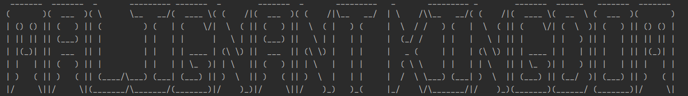

# Malignant Kingdom

An adventure game built during week 9-10 of my software development course at _nology. 

The world is a cruel, heartless place. You are a criminal, tossed in jail for serious crimes against the realm.

Can you survive this malignant kingdom? 

## Instructions

The game can be played in the console. Clone the repository down and play it using your Java IDE of choice (e.g. IntelliJ).

### Languages/Frameworks Used

* Java

### Credits

ASCII art taken from [ASCII Art Archive](https://www.asciiart.eu/) and [ASCII.co.uk](https://ascii.co.uk/art)

[Figma](https://www.figma.com/file/UQ7NcCBE9NScccttfMR9e2/Portfolio---Week-1?node-id=0%3A1). 