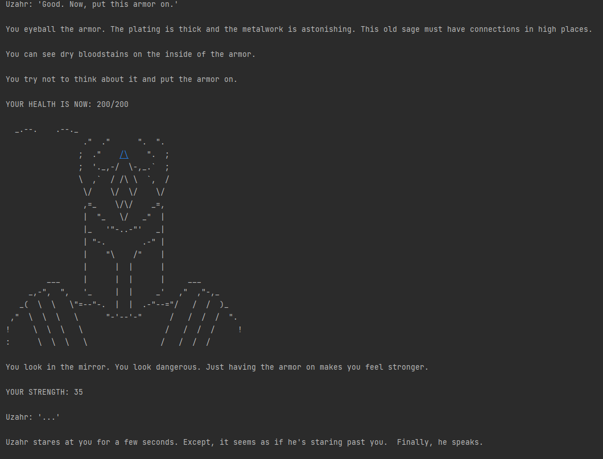
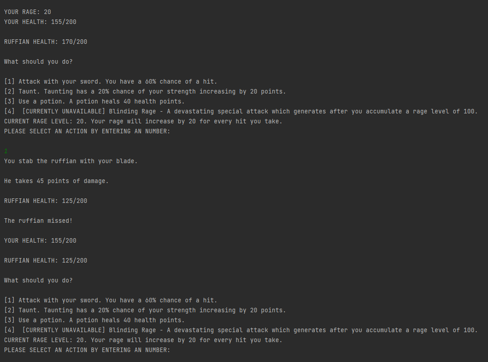

# Malignant Kingdom

An adventure game built during week 9-10 of my software development course at _nology. 

You are a criminal, tossed in jail for serious crimes against the realm.

Can you escape your fate and survive this malignant kingdom? 

## Instructions

The game can be played in the console. Clone the repository and play it using your Java IDE of choice (e.g. IntelliJ).

## Languages/Frameworks Used

* Java

## Screenshots 
1.

2.

3.

## Credits

ASCII art taken from [ASCII Art Archive](https://www.asciiart.eu/) and [ASCII.co.uk](https://ascii.co.uk/art) .